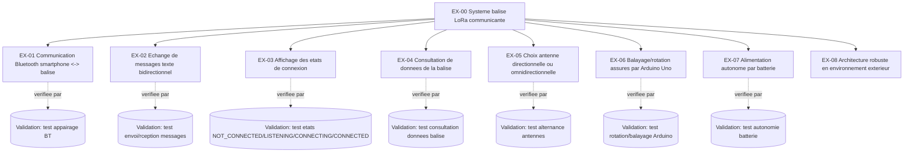
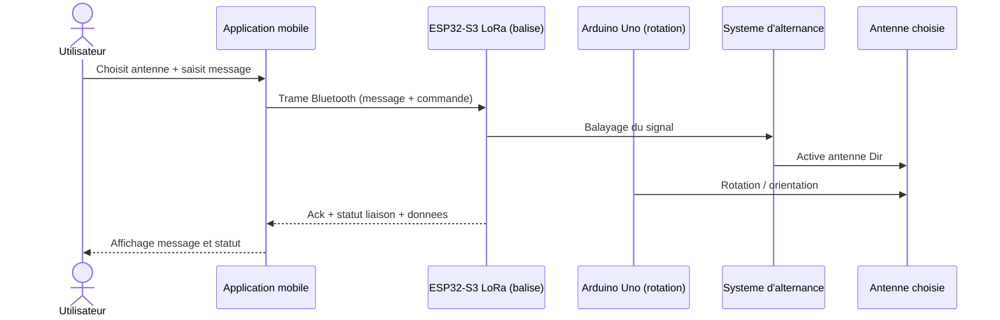
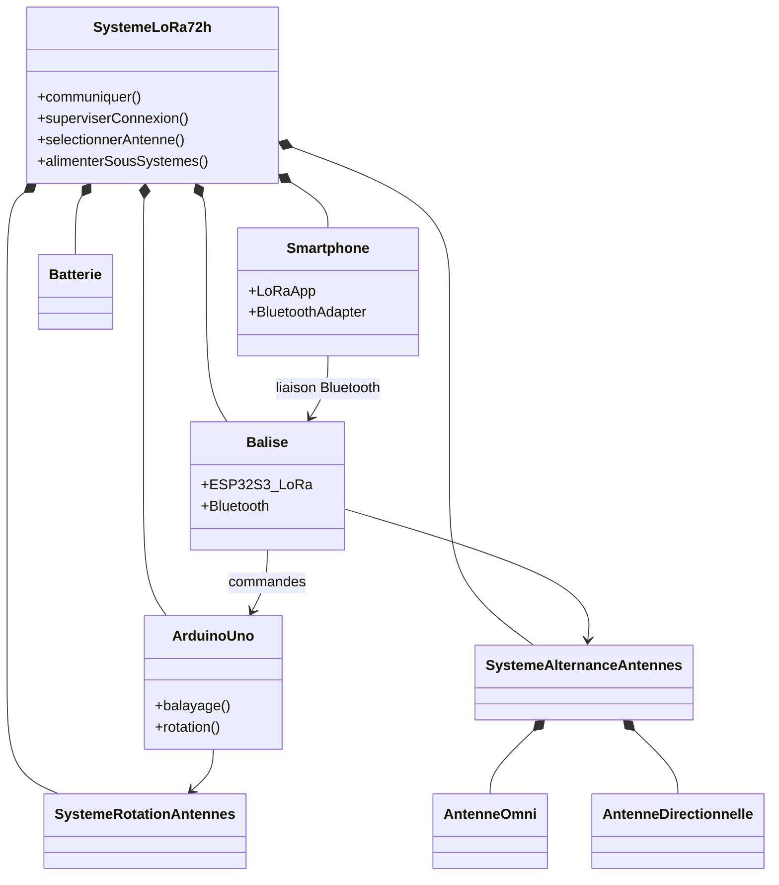
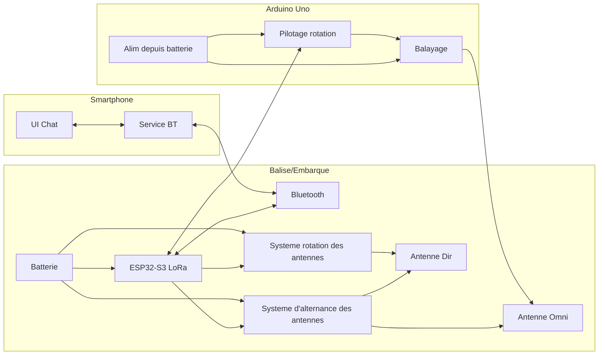
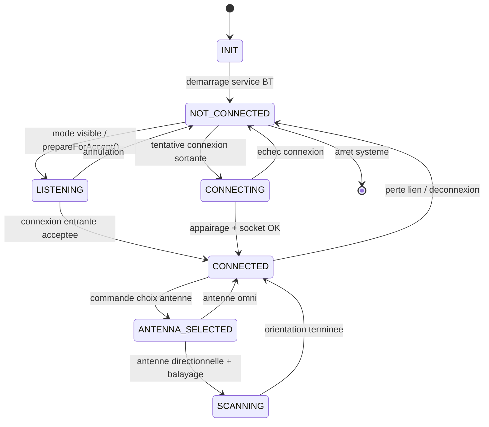
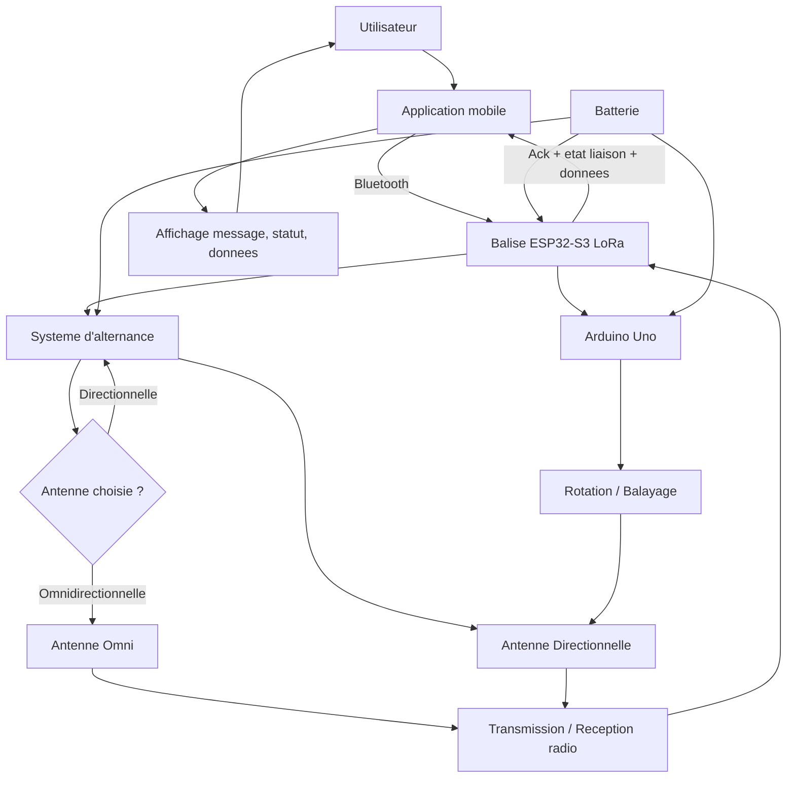

# Diagrammes SysML - Projet LoRa 72h

Regrouper diagrammes projet:
- smartphone avec application de messagerie Bluetooth,
- balise basee sur ESP32-S3 LoRa,
- Arduino Uno pour balayage et rotation,
- systeme d'alternance entre antenne directionnelle et omnidirectionnelle,
- alimentation batterie pour les sous-systemes embarques.

## 1) Diagramme de cas d'utilisation

```mermaid
flowchart LR
  rU["Utilisateur"]:::role
  rAPP["<< service>>\nApplication mobile"]:::role
  rESP["<< service>>\nESP32-S3 LoRa"]:::role
  rARD["<< service>>\nArduino Uno"]:::role
  rConnect["<< service>>\nSe connecter a la balise Bluetoot03"]::role

  subgraph S["Balise LoRa"]
    direction TB
    ucSend([Envoyer un message texte])
    ucReceive([Recevoir un message texte])
    ucStatus([Consulter l'etat du lien])
    ucData([Consulter des donnees balise])
    ucSelectAntenna([Choisir antenne Omni/Dir])
    ucScan([Lancer balayage])

    ucSend -. include .-> rcConnect
    ucReceive -. include .-> rcConnect
    ucStatus -. include .-> rcConnect
    ucData -. include .-> rcConnect
    ucSelectAntenna -. include .-> ucData
    ucScan -. include .-> ucSelectAntenna
  end

  rU --- rAPP
  rAPP --- rconnect
  rconnect --- rESP

  ucSend --- rESP
  uStatus --rESP
  ucData --- rESP
  ucSelectAntenna --- rESP


  ucScan --- rARD

  classDef role stroke-width:0px;
```

## 2) Diagramme des exigences



## 3) Diagramme de sequence (envoi d'un message)



## 4) Diagramme de blocs (BDD)



## 5) Diagramme de bloc interne (IBD simplifie)



## 6) Diagramme d'etat (connexion Bluetooth)



## 7) Schema de fonctionnement global

