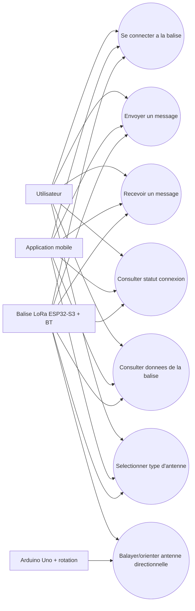
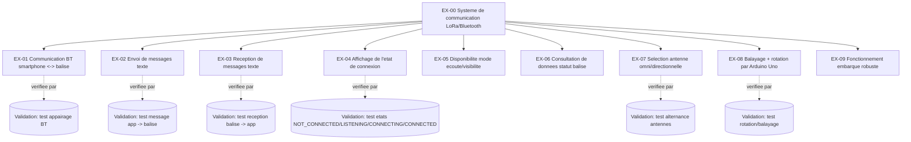
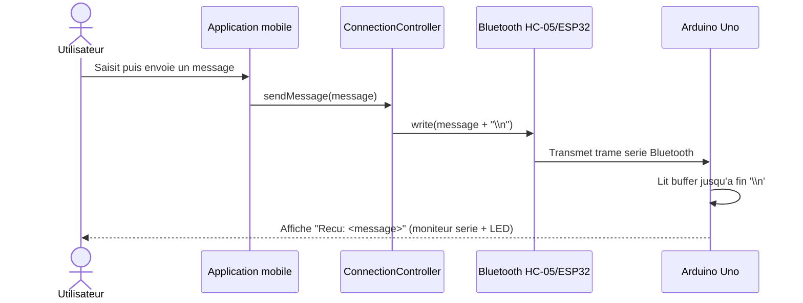
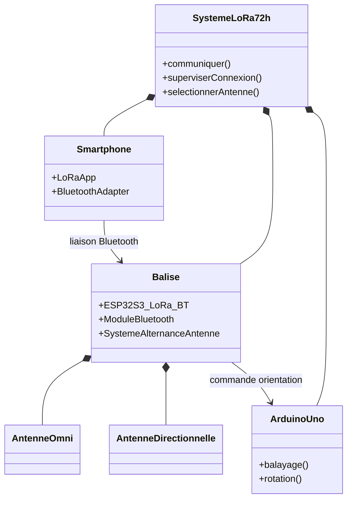
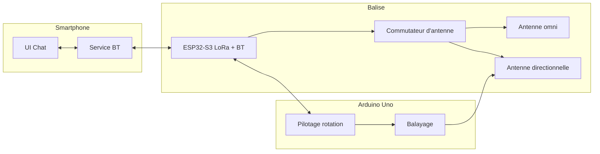
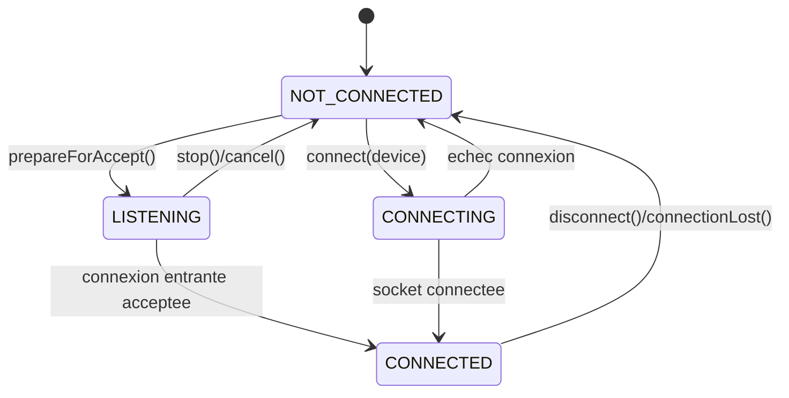

# Diagrammes SysML - Projet LoRa 72h

Regrouper diagrammes projet:
- smartphone avec application de messagerie Bluetooth,
- balise LoRa basee sur ESP32-S3 LoRa + Bluetooth,
- systeme d'alternance d'antennes (omnidirectionnelle / directionnelle),
- Arduino Uno pour balayage et rotation de l'antenne directionnelle.

## 1) Diagramme de cas d'utilisation

## 2) Diagramme des exigences

## 3) Diagramme de sequence (envoi d'un message)

## 4) Diagramme de blocs (BDD)

## 5) Diagramme de bloc interne (IBD simplifie)

## 6) Diagramme d'etat (connexion Bluetooth)

RAVAVA JE VAIS ME TROUER LE DERCHE